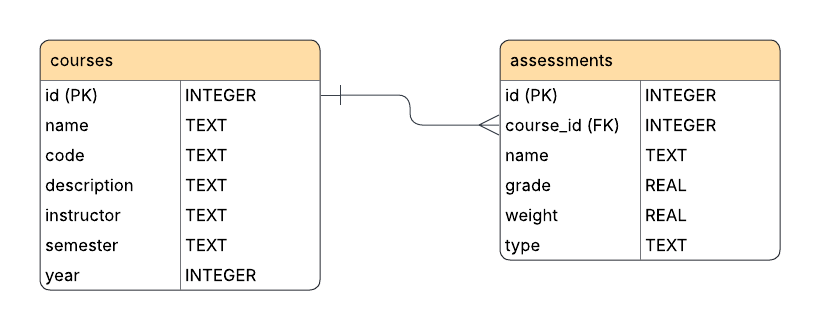

# course-tracker-and-analyzer
This project is a Python Tkinter app that lets the user manage courses 
and can perform basic analysis. 


## Models
The models that the application deals with are Courses and Assessments.

This database of the application follows the ER diagram:


### Database
This project uses `sqlite3` as the database management system and
`sqlalchemy` as the library for ORM mapping.

When setting up the project for the first time, you'll need to setup
the database tables. 
Run the following script to create all necessary tables:
```
python models/create_db.py
```

To enter the sqlite CLI (command line interface) for this 
project run from the project's root directory:
```
sqlite3 database.db
```


TODO: 
  - Add year column to courses table to ER diagram
